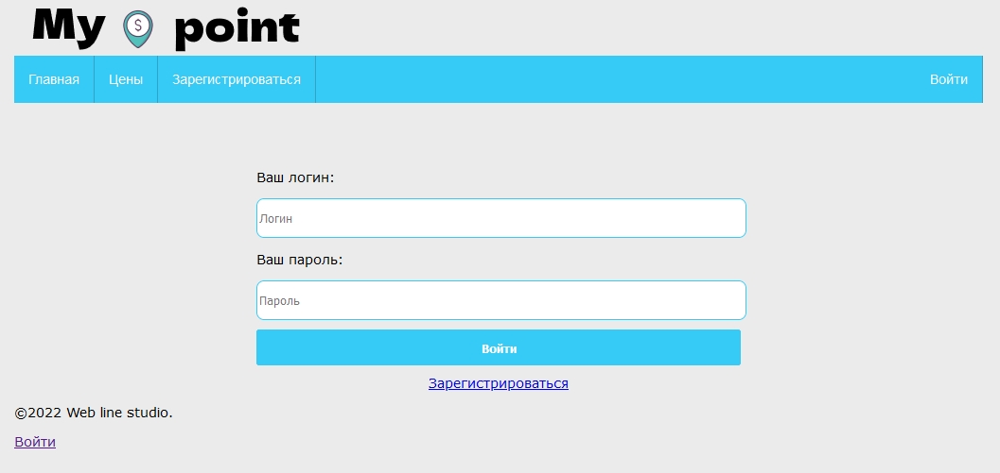

<h1>Веб приложение для малого бизнеса (отслеживание товаров)</h1>
Ver. 0.1 (стадия разработки)

Автор Пичугин Дмитрий

Доступ к репозиторию:
```
https://github.com/Pichugin1996/my-point.git
gh repo clone Pichugin1996/my-point
```
<h3>Превью изображения:</h3>


<details>
<summary>Изображения</summary>





  
</details>


<h3>В проекте используется:</h3>
Spring security,
Spring boot,
Spring data,
Spring web,
Thymeleaf.

<h2>ЭТОТ ФАЙЛ ЕЩЕ НЕ ОФОРМЛЕН ДО КОНЦА!</h2>